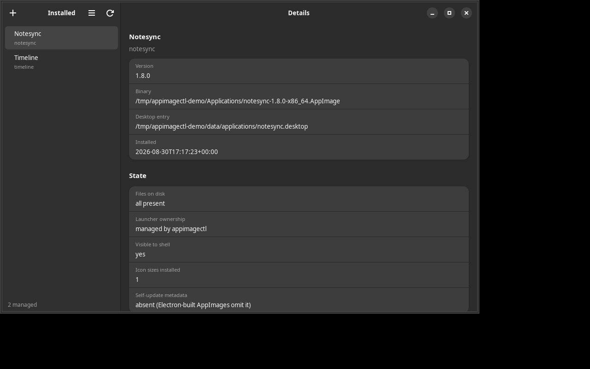
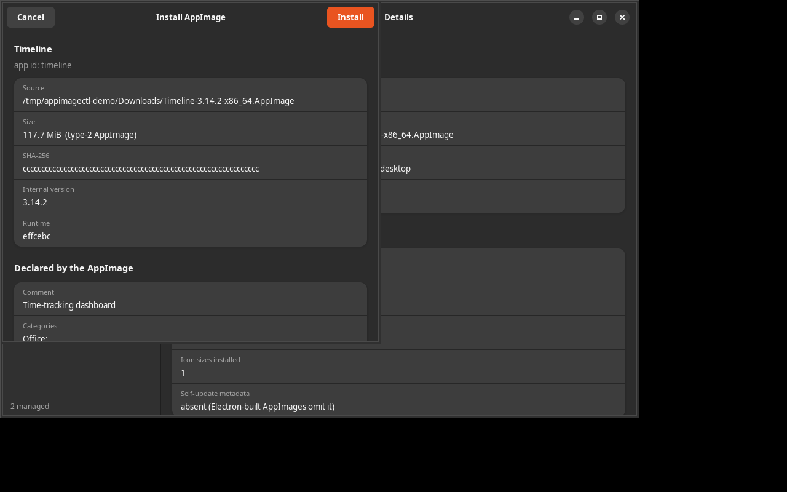

# appimagectl

> Install, uninstall, inspect, update and clean AppImages — with safe desktop
> integration on Linux. CLI core with JSON output, plus a GTK4/libadwaita GUI.

**Why this exists:** the usual AppImage workflow is download → chmod +x →
hand-write a `.desktop` entry → pray the icon lands. And uninstalling is
worse: nobody remembers which files were created. `appimagectl` makes install
one command and makes **uninstall provably safe** — it only ever deletes files
it can prove it created.

## Screenshots

<p align="center">
  
</p>

The main window: inventory on the left, evidence for the selected app on the
right. Every value shown comes from the same code path the CLI reports —
nothing is faked.

<p align="center">
  
</p>

The install dialog: inspect-then-confirm. Nothing is written until
**Install** is pressed, and the dialog shows exactly what will be written.

## Features

- **Install** — validates the file is a real AppImage (ELF + `AI\x02` magic),
  extracts only the `.desktop` entry and hicolor icons from the payload (never
  the whole 180 MB), SHA-256 verifies the copy, writes a managed launcher,
  validates it with `desktop-file-validate`, refreshes caches.
- **Safe uninstall** — deletes only manifest-listed files; moves the binary to
  trash (never hard-deletes it); refuses to touch launchers it did not create.
- **Adopt** — claim an existing manual install into management without
  reinstalling.
- **Clean** — move an app's user data (config/cache/data/state/dot-dirs) to
  trash; warns when the app is still running.
- **Verify** — re-hash the binary against the manifest, check launcher
  marker, icons, shell registration.
- **Trash** — `list`, `restore`, `empty` for uninstalled binaries and cleaned
  data. `trash empty` is the ONLY place data is permanently deleted, and it
  requires `--yes`.
- **Updates** — query embedded GitHub release update information, download and
  swap in the new version (old binary to trash). Reports honestly when an
  AppImage ships no update metadata (Electron-built AppImages omit it).
- **GUI** — GTK4 + libadwaita front end (thin layer over the CLI core).
- **Machine-readable** — every command emits JSON with `--json`.
- **Dry-run everywhere** — every destructive command prints its exact plan
  first.

## Install

Requirements: Python ≥ 3.11, and for the GUI `gir1.2-gtk-4.0 gir1.2-adw-1`
(GTK4 + libadwaita) with PyGObject.

```bash
git clone <your-repo-url> && cd appimagectl
python3 -m venv --system-site-packages .venv   # PyGObject comes from the system
./.venv/bin/pip install -e .
appimagectl --version
```

Or without a venv:

```bash
pip install --user .
appimagectl --version
```

## Usage

```text
appimagectl install /path/to/App.AppImage     # integrate into the desktop
appimagectl inspect /path/to/App.AppImage     # read metadata, touch nothing
appimagectl adopt app-id                      # claim an existing manual install
appimagectl uninstall app-id                  # remove launcher+icons, trash binary
appimagectl clean app-id                      # move user data (config/cache/dotdirs) to trash
appimagectl verify app-id                     # re-hash binary + check every installed file
appimagectl trash list|restore <name>|empty   # manage trashed binaries and cleaned data
appimagectl check-update app-id               # query GitHub release upd_info (network)
appimagectl update app-id                     # download and swap in the newer version
appimagectl scan [dirs]                       # find AppImage files (default ~/Downloads, Desktop, ~/.local/bin)
appimagectl list                              # managed apps + health
appimagectl doctor                            # environment + install integrity
appimagectl run app-id                        # launch a managed app
appimagectl gui                               # GTK4 front end
```

Every command supports `--json` for machine-readable output. Add
`--dry-run` to any destructive command to see the plan without touching the
system.

### Quick tour

```bash
# 1. Inspect what you are about to install (read-only)
appimagectl inspect ~/Downloads/MyApp-x86_64.AppImage

# 2. Install it
appimagectl install ~/Downloads/MyApp-x86_64.AppImage

# 3. See everything you manage — with health checks
appimagectl list

# 4. Re-verify integrity later (hash the binary against the manifest)
appimagectl verify myapp

# 5. Check for a newer release from the app's embedded update source
appimagectl check-update myapp
appimagectl update myapp

# 6. Remove it — launcher + icons deleted, binary moved to trash
appimagectl uninstall myapp
appimagectl trash list
appimagectl trash restore MyApp-x86_64.AppImage   # changed your mind? restore
```

## How install works

1. Verify the file is a real AppImage (ELF + `AI\x02` magic at offset 8).
2. Extract only the `.desktop` entry and hicolor icons from the payload —
   never the whole ~180 MB — and SHA-256 the file.
3. Copy to `~/Applications` (configurable via `APPIMAGECTL_STORE`), chmod +x,
   verify the copy byte-for-byte, then delete the copy on mismatch.
4. Write a **managed** `.desktop` entry: same Name/Icon/Categories as the
   AppImage declares, Exec rebuilt to the absolute path, plus provenance keys:

   ```ini
   X-AppImageCtl-Managed=true
   X-AppImageCtl-Id=myapp
   X-AppImageCtl-Sha256=<hex>
   ```

5. Validate with `desktop-file-validate` — roll back everything on failure.
6. Refresh desktop + icon caches. Record a manifest in
   `~/.local/share/appimagectl/apps/<app-id>.json` listing **every file
   created**.

## Safety model

| Rule | What it means |
|---|---|
| Manifest-only deletion | `uninstall` deletes exactly the files recorded at install time. No manifest → no deletion. |
| Managed-marker guard | A `.desktop` file without `X-AppImageCtl-Managed=true` is treated as foreign. Install refuses to overwrite it; uninstall refuses to delete it. |
| Trash, not delete | `uninstall` and `clean` MOVE the binary/data to `~/.local/share/appimagectl/trash/`. Only `trash empty --yes` unlinks data. |
| SHA-verified copy | The installed binary is hashed and compared to the source before install completes; mismatch → the copy is removed. |
| Dry-run first | Every destructive command prints its planned file changes before executing; `--yes` is required where permanent deletion or user-data moves are involved. |
| Honest updates | `check-update` reports `not updatable` when the AppImage embeds no usable update information instead of inventing one. |

The result: `appimagectl` can never damage a launcher created by apt, flatpak,
or your own hand.

## Update sources

AppImages embed an `update_information` string (per the
[AppImage specification](https://docs.appimage.org/packaging-guide/optional/updates.html)).
`appimagectl` understands the GitHub form
(`gh-releases-zsync|owner|repo|latest|*x86_64.AppImage`) and queries the public
GitHub releases API. No token is required for public repos.

Most Electron-built AppImages (ZCode, Cursor, Agent Orchestrator, ...) carry an
**empty** `.upd_info` section: there is no zsync/GitHub metadata to consume, so
no update tool can help. In that case updating means downloading the new
release and re-running `install`.

## Configuration

| Variable | Default | Purpose |
|---|---|---|
| `APPIMAGECTL_STORE` | `~/Applications` | Where integrated binaries live |
| `XDG_DATA_HOME` | `~/.local/share` | Launchers, icons, manifests, trash |
| `XDG_CONFIG_HOME` | `~/.config` | `mimeapps.list` |

Everything respects XDG base-directory environment variables.

## Development

```bash
python3 -m venv --system-site-packages .venv   # PyGObject comes from the system
./.venv/bin/pip install -e '.[dev]'
./verify.sh                                    # ruff + pytest + CLI smoke
```

See [CONTRIBUTING.md](CONTRIBUTING.md) for the full contributor guide —
including how screenshots are regenerated (they are real captures, never
mockups).

## Project layout

```text
src/appimagectl/
  paths.py       XDG paths, constants
  appimage.py    magic/ELF inspection, .desktop parsing, icon extraction
  manifest.py    per-app install manifest (the file list that makes uninstall safe)
  desktop.py     render/validate .desktop entries, icon install, cache refresh
  core.py        operations; plain-dict results for CLI and GUI
  maintenance.py clean (data→trash), verify, trash list/restore/empty, scan
  updates.py     GitHub-release update detection (check-update/update)
  cli.py         argparse front end, --json everywhere
  gui/app.py     GTK4/libadwaita front end (thin layer over core)
tests/           pytest suite, sandboxed XDG paths
```

## License

MIT — see [LICENSE](LICENSE).

## Changelog

See [CHANGELOG.md](CHANGELOG.md).